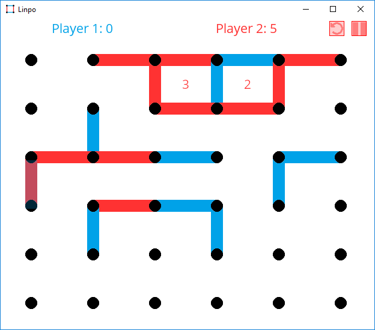
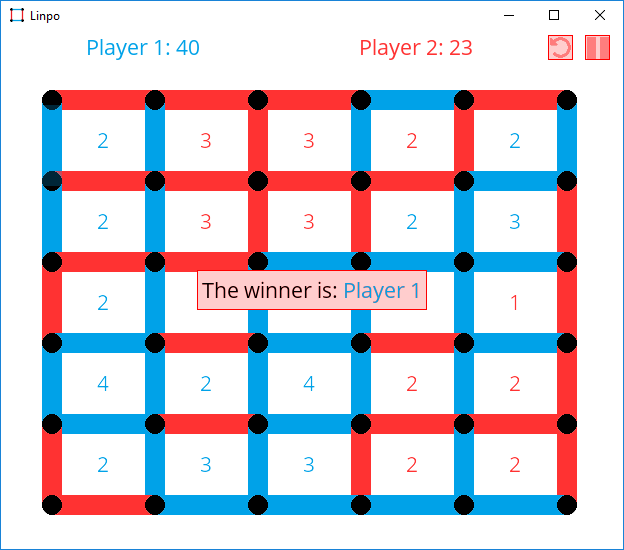
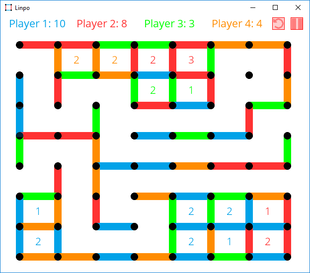
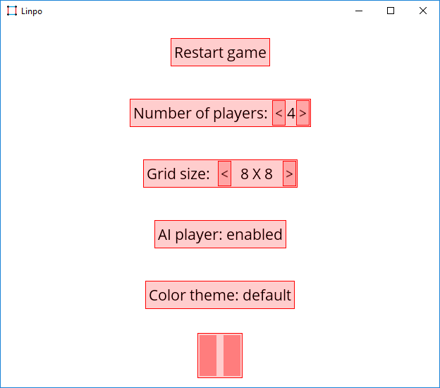
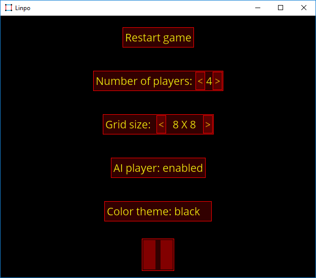
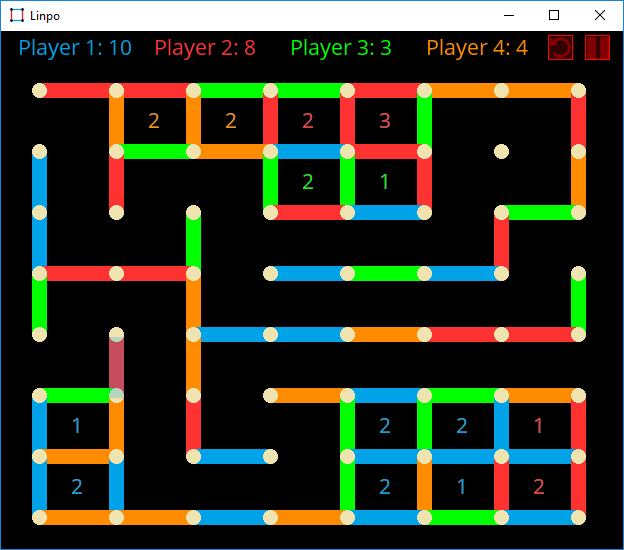

# Linpo

A game of lines and points.

## About

**Linpo** is a game based on the classic pencil-and-paper game: Lines and points (or [Dots and Boxes](https://en.wikipedia.org/wiki/Dots_and_Boxes)). The game is written using only **SDL2** and [SDL2_ttf](https://www.libsdl.org/projects/SDL_ttf/) (so it is very cross-platform).

Tested on _Windows_ and _Android_.

This was one of my first ever games (built during summer holidays of 2016).

### Rules

[Wikipedia](https://en.wikipedia.org/wiki/Dots_and_Boxes) citation:
> The game starts with an empty grid of dots. Usually two players take turns adding a single horizontal or vertical line between two unjoined adjacent dots. A player who completes the fourth side of a 1×1 box earns one point and takes another turn. (A point is typically recorded by placing a mark that identifies the player in the box, such as an initial.) The game ends when no more lines can be placed. The winner is the player with the most points. The board may be of any size grid.

### Features

  * The game can be played by 1 to 4 players (1 player vs 1-3 AI controlled players or 2-4 players sharing the same mouse),
  * adjustable grid size,
  * dark and bright color theme,
  * undo button,
  * resizable window (on desktop),
  * stored preferences files,
  * lightweight and small executable,
  * cross-platform ...

### Screenshots

  

  

  

  

  

  


## Setup 

On desktop (windows):

  1. ```git clone https://github.com/mare5x/Linpo.git```
  2. Include and link SDL2 and SDL2_ttf.
  3. Build project Linpo.
  4. Copy _.dll_ files that come with SDL2 and SDL2_ttf to Linpo.exe directory.
